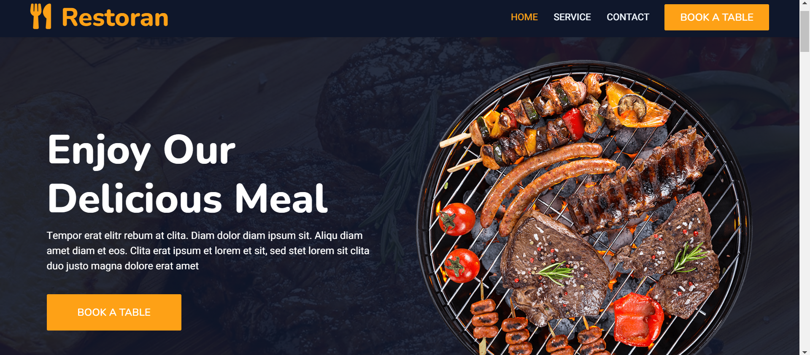

# Restoran - Bootstrap Restaurant Website

This project is a modern, responsive restaurant website built with HTML, CSS, and Bootstrap. The website includes sections for services, contact, and an option for users to book a table.

## Features

- **Responsive Design**: The layout adjusts beautifully to different screen sizes, ensuring a seamless experience on both desktop and mobile devices.
- **Navigation**: A clean and simple navigation menu to easily access the Home, Service, and Contact sections.
- **Book a Table**: A prominent call-to-action button for booking a table.
- **Hero Section**: A full-width banner image showcasing delicious grilled food to grab users' attention.
- **Bootstrap Integration**: The website is styled and laid out using the Bootstrap framework, making it fast to load and easy to maintain.

## Screenshot



## Technologies Used

- **HTML5**: For the structure of the webpage.
- **CSS3**: For styling and layout adjustments.
- **Bootstrap**: To ensure responsiveness and provide ready-to-use components like buttons and navigation.
- **JavaScript**: For additional interactivity (if needed).
  
## Installation

1. **Clone the repository**:
   ```bash
   git clone https://github.com/yourusername/restoran-website.git
   cd restoran-website
``
### Usage
**Home Page:**
 The home page features a hero section with an image of grilled food and a call-to-action to book a table.

**Services Section:**
 This section outlines the services provided by the restaurant.

**Contact Page:**
 A simple contact form that allows users to get in touch with the restaurant.
Customization

### Contributing
Contributions are welcome! Feel free to submit a pull request or open an issue if you have suggestions or find any bugs.


License
This project is licensed under the MIT License.